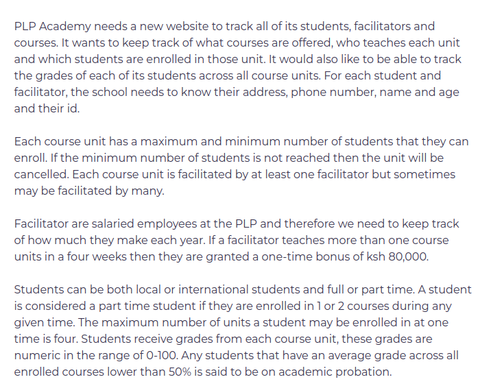

# week3-day2-project
PLP Web Technology. Week 3 (day2) project
[LIVE VIEW PROJECT](https://waasike.github.io/week3-day2-project/)
  
DONE:  
✓ Courses offered displayed  
✓ Teachers/Facilitators teaching courses displayed  
✓ C course cancelled due to lack of minimum no. of students achieved 
✓ Attributes of students & teachers recieved through sign up 
✓ Additional salary(ksh.80,000) given to Mr.Hillary(view when loging in to facilitator account) 
✓ Local student below average grade hence academic probation(view when logging in to local student account)
